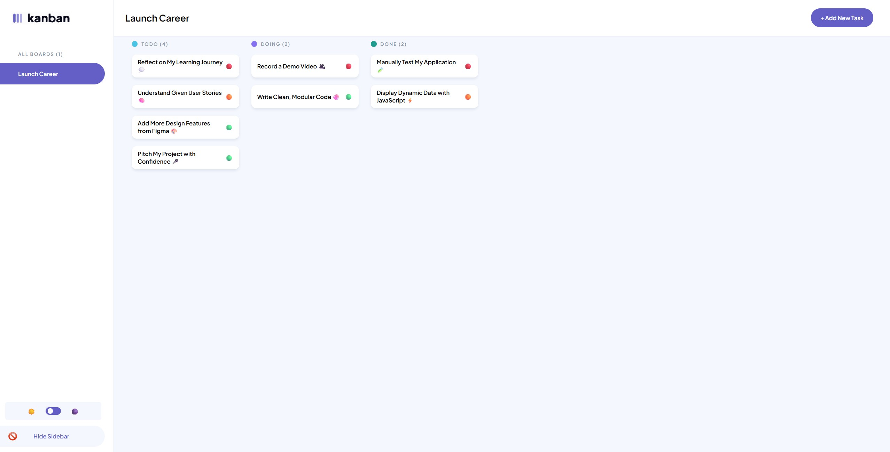
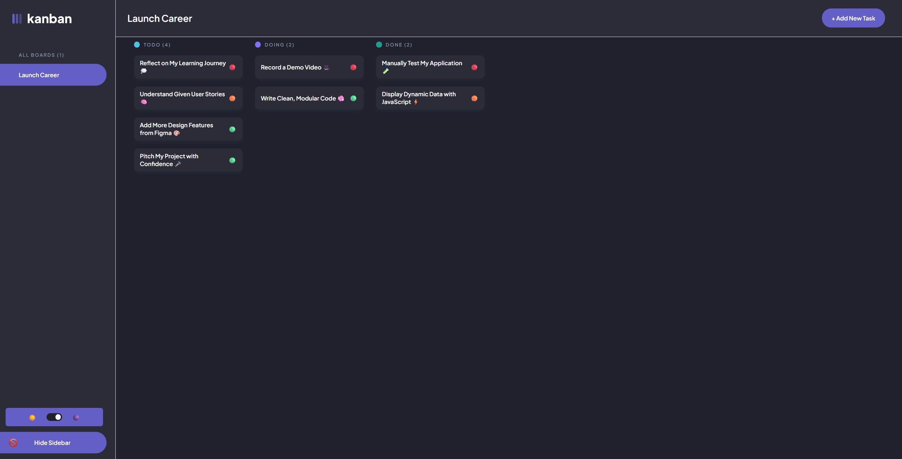
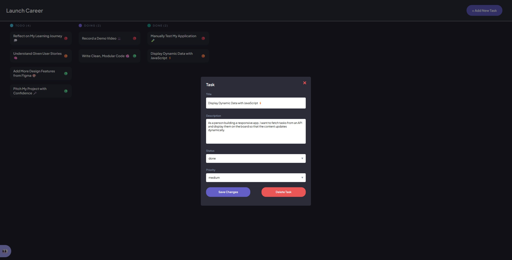
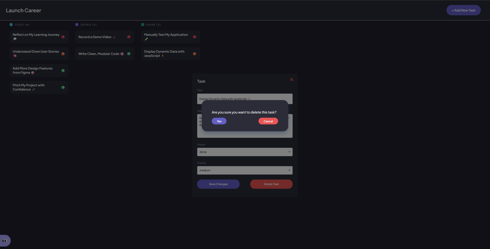

# JSL Portfolio Piece: Kanban App Deployment & Features Implementation

## Project Description

This project involves **deploying a Kanban app to Netlify**, ensuring the app's functionality and persistence through local storage, and implements dynamic features such as task editing, deletion, sidebar interaction, and a theme toggle. It is a fully functional, deployed application that is responsive across devices and maintains data consistency.

## Setup Instructions

1. Clone or download this repo, **or** visit the provided Netlify link below
2. If downloaded, extract files and open index.html in VSCode, opening it directly in your browser will not work
3. Then use the Live Server extension to view the web page and all its features
4. Tasks will show up dynamically and you can click them to view their information
5. Add, edit or delete tasks however you please

#### Netlify Link

[Kanban Board Netlify Link](https://chris-lord-kanban-board.netlify.app/)

## Technologies Used

- HTML
- CSS
- JavaScript
- Netlify

## Features

- Page is deployed with Netlify, so can be accessed whenever you feel like it
- Dynamic task display, fetched from an API and stored in local storage
- Clickable tasks
- When clicked, tasks will display a modal with all relevant task information
- Task information is editable, and be saved with the **Save Changes** button
- **+ Add New Task** button can be clicked to open a modal where you can input information for a new task
- Can click **Create Task** to save the task and it will be displayed on the webpage
- Add New Task modal has form validation, so you won't be able to submit with blank inputs
- Initial tasks and any added, edited or deleted tasks will be save to local storage, so will persist across refreshes
- Tasks can be deleted with **Delete Task**, with a confirmation message to make sure you really mean it
- Web page theme can be toggled between light and dark mode
- Preferred theme is stored in local storage, so will persist across reloads
- Desktop sidebar can be hidden and shown whenever the need may arise
- On mobile, the app logo can be clicked to open the mobile sidebar menu
- Tasks display a given priority (default: "low")
- Tasks are ordered in their columns from highest to lowest priority

## Usage Examples

- Dynamically displaying a list of tasks
- Adding new tasks to the task board
- Keeping track of tasks and viewing their information when clicked
- Editing or deleting selected tasks to keep them up to date
- Noting tasks by priority in order to know the most important ones

   

   

## Usage instructions

- Tasks will show up dynamically when fetched from an API
- Once loaded, you can click a task to view its information
- You can edit the task information through the pop-up and click **Save Changes** to commit the changes
- All pop-ups can be closed by clicking the red 'X' in the top right corner
- Click the **+ Add New Task** button to enter new task data and then create the task to save it to the task board
- If you are no longer a fan of your new task, or any of the other tasks, pressing **Delete Task** in the task pop-up will remove it
- To make sure you really want to delete something, a confirmation notice will pop up to check if you are sure
- In the sidebar you can use the day/night toggle button to switch between light and dark mode
- From the sidebar you can also hide the sidebar entirely, and show it again with the "👀" button that appears
- On mobile, click the app logo to show the mobile sidebar
- In the task editing pop-up you can change a tasks priority

## Presentation Link

[JSLPP Presentation Link](https://drive.google.com/drive/folders/19TUtQUPY8AkmjHjNIQN7fiKmJTOjCd_c?usp=sharing)

---

## WHAT to Submit

- **JSLPP GitHub Repo**: Your JSLPP GitHub repository
- **Recorded Presentation:** A **5-10 minutes** presentation of your project demonstrating and talking through how you solved the user stories. No slides are neccessary and you will rather showcase your code and project features as you talk through your solutions.
  - You can use any of these tools to record your presentation [Veed.io](https://www.veed.io/) [Windows recording](https://www.microsoft.com/en-us/windows/learning-center/how-to-record-screen-windows-11), [Zoom](https://www.zoom.com/), [Loom](https://www.loom.com/), [OBS](https://obsproject.com/), [Screencastify](https://www.screencastify.com/)
  - Make sure your recorded presentation link is publicly accessible and is included in your GitHub README.

## HOW to Submit Your Project

- Push Final Version to GitHub: Ensure your final work is on GitHub.
- Project Naming Convention: Make sure the name of your GitHub Repository is correct with the right naming convention. The naming convention is given in the GitHub Repo title. `StudentNo_Classcode_Group_Name-Surname_JSLPP`
- Include Presentation Assets: Include your recorded presentation link in your GitHub README.
- Deployment Link: Include a link to your deployed app in your GitHub README.
- Provide LMS Link: Submit your Project GitHub link via the [Projects] tab > JSLPP PORTFOLIO PIECE > on the Learning Management System.

## Before You Begin

**Check out the [Figma Reference File](https://www.figma.com/design/y7bFCUYL5ZHfPeojACBXg2/Challenges-%7C-JSL?node-id=6033-11092&t=XbQhBWPYxXDAqp3x-1) and the project user stories in your student dashboard** before you start building.

## Key Objectives

### Deployment & Hosting

- **Prepare the Kanban app files** for deployment, ensuring the project structure aligns with best practices for deployment.
- **Deploy the Kanban app to Netlify**, following the process of uploading your project and setting a custom deployment link.
- Test the deployed app to ensure that all features, including task creation, editing, local storage, and sorting, work as expected in a live environment.

### Initial Data Fetching & Loading State

- **Fetch tasks dynamically** from an API: https://jsl-kanban-api.vercel.app/

- **Replace any hard-coded task data**, to ensure the application receives the most up-to-date tasks.

- **Display a loading message** while the tasks are being fetched so that users are informed the data is loading.
- If fetching fails, **show an error message** to alert users to the issue.

### Data Persistence

- **Store fetched tasks in local storage** to ensure data persists across page reloads.
- On startup, **load tasks from local storage** and display them in their respective columns (To Do, Doing, Done) to maintain an organized task board.

### Task Editing & Deletion

- Allow users to **edit task details** (title, description, status) in a modal. Upon saving, the task should reflect the updated data on the board and in local storage.
- Implement a **delete button** within the modal to allow users to remove tasks. A confirmation message should appear before deleting a task, and if confirmed, the task will be removed from both the task board and local storage.

### Sidebar Interaction

- Implement a **sidebar** that contains all required elements as shown in the Figma design.
- Allow the sidebar to be **toggleable**, so users can hide or show it based on their preferences.
- Provide a mobile version of the sidebar that can be **accessed from the app logo**, and ensure it matches the design and functionality of the desktop sidebar.

### Mobile Sidebar (Menu) Functionality

- On mobile, the sidebar should function as a **menu** accessible from the top of the screen.
- Include the **theme toggle** switch in the mobile menu and ensure all features match the desktop sidebar, as shown in the Figma design.
- Ensure that the mobile menu is **closable**, allowing users to dismiss it for an unobstructed view of the tasks.

### Theme Toggle (Dark/Light Mode)

- Include a **theme toggle switch** to allow users to switch between dark mode and light mode.
- The toggle should be functional in both the **desktop sidebar** and the **mobile menu** for consistent theme switching across devices.
- Ensure all elements of the **Kanban board** are styled appropriately in dark mode, ensuring good contrast and readability.

### Stretch Goal: Adding Priority (Optional)

Enhance your task management application by introducing a **priority system**. Users should be able to select a priority level—**High, Medium, or Low**—when creating or editing tasks. The priority should be:

- **Visually displayed** on each task card as shown on the Figma design to clearly communicate urgency.
- **Saved to local storage** to ensure persistence across page reloads.
- **Editable** so users can adjust a task's importance as needed.
- **Reflected immediately** on the UI upon changes.
- **Sorted automatically** within each status column by priority (High → Medium → Low), with **High-priority tasks appearing at the top**.
- **Persistently ordered**, maintaining correct priority display after refreshing the page.

## Code Quality & Maintainability

- **Break the code into separate modules** with clear responsibilities (e.g., local storage handling, task rendering, modal management) to improve maintainability and scalability.
- Use **descriptive, meaningful variable and function names** to make the code easy to understand.
- **Document every major function and module** using **JSDoc comments** to explain the purpose, parameters, and return values of each part of the code.

## Expected Outcome

A fully functional Kanban app that:

- Dynamically fetches and displays tasks.
- Supports task editing, deletion, and persistent storage through local storage.
- Has a responsive, mobile-friendly sidebar with a theme toggle switch.
- App deployed to **Netlify** with a custom, readable URL.
- Uses modular, well-documented code that is easy to maintain and scale.
